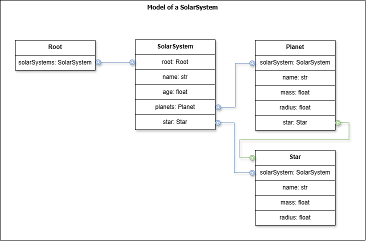
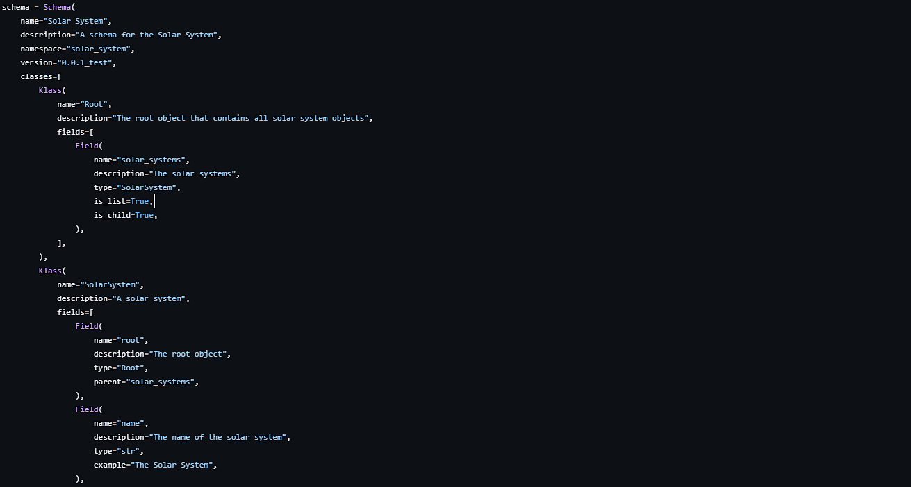

# Overview

In this article, we will generate a C++ data model for a Solar System using the Python `cmg` package: https://pypi.org/project/cmg

We will:

* Install the `cmg` package
* Create the Solar System data model (schema) using Python
* Generate C++ code for the Solar System data model
* Create a C++ application that uses the generated data model, including writing and reading data using the file system
* Compile and run the C++ application

## Prerequisites

For the article, you will need to know the following:

* How to install Python packages
* Basic understanding of C++ including classes, inheritance, and pointers
* Basic understanding of Python
* How to compile C++ code using `cmake` (or any other build tool)

## What is CMG?

`cmg` stands for "C++ Model Generator". It is a Python package that generates C++ code for data models. It is useful for generating boilerplate code for data models that are used in C++ applications.

Advantages of using `cmg`:

* Eliminates the need to write boilerplate code for data models in C++
* Useful for high-performance applications and low memory footprint
* Easy to use and integrate with existing C++ code
* Makes generating complex data models easy and less error-prone

> NOTE: If you don't need high performance or low memory footprint, you can use other data modeling techniques like ORM (Object Relational Mapping), other data modeling libraries, or Python dataclasses.

`cmg` can be used to generate C++ data models for various applications, including:

* Scientific computing
* Machine learning
* Simulation software
* and many more ...

## Installing CMG

To install `cmg`, run the following command:

```bash
pip install cmg
```

You should have `cmg` installed on your system. You can verify the installation by running the following command:

```bash
cmg --help
```

## Solar System Data Model

The following class diagram shows the data model for a Solar System:



Blue lines represent parent-child relationships, while green lines represent associations.

Each class has a selection of members, representing various properties of each object.

## Create the Solar System Data Model using Python

We will generate the Solar System data model using Python. `cmg` contains an example https://github.com/johndru-astrophysics/cmg/blob/1.2.0/examples/solar_system.py that we will use for this article.

There are three main steps to generate the Solar System data model:

1. Define a `Schema` object
2. Add `Klass` objects to the `Schema` object
3. Add `Field` objects to the `Klass` objects



A `Schema` contains the `name` and `description` of the schema, a C++ `namespace`, a `version` number or tag, and a list of `Klass` objects.

A `Klass` contains the `name` and `description` of the class, and a list of `Field` objects.

A `Field` contains the `name`, `description`, and `type` of the field.

The `type` can be any C++ primitive type (defined in https://en.cppreference.com/w/cpp/language/types), or a user-defined type (another `Klass`).

There are also optional parameters for `Field` objects:

| Parameter | Description |
| --- | --- |
| example | Required for primitive types, optional for user-defined types. It is a value that represents an example value for the field. |
| default | Optional. It is a value that represents the default value for the field. If specified, the `is_optional` value is assumed to be True. |
| is_optional | Optional. It is a boolean value that represents if the field is optional. Default is False. |
| is_child | Optional. It is a boolean value that represents if the field is a child object (i.e. blue line in class diagram). Default is False. |
| is_list | Optional. It is a boolean value that represents if the field is a list of objects. Default is False. |
| parent | Optional. It is a string that represents the name of the parent field. Each child object requires a field that points to its parent. |

In our example, we have 4 main classes:

* `Root` - represents the root of the model to contain multiple `SolarSystem` objects
* `SolarSystem` - represents a solar system that contains multiple `Planet` objects and one `Star` object
* `Planet` - represents a planet that references a `Star` object
* `Star` - represents a star

## Generate the Solar System Data Model C++ Code

Let's generate the Solar System data model using the `cmg` package:

```bash
cmg --schema examples/solar_system.py --output generated
```

`cmg` performs the following steps:

* Parses the Python file `examples/solar_system.py`
* Validates the `examples/solar_system.py` file before generating the C++ code
* Generates the C++ code for the Solar System data model in the `generated` directory.

If there are any errors in the Python file, `cmg` will display an error message and exit.

The generated code will contain the following files:

```
CMakeLists.txt        - Used to compile the C++ code using CMake

identifiable.cpp/hpp  - implementation of the Identifiable class,
                        used to generate unique identifiers for each object

index.cpp/hpp         - implementation of the Index class, used to generate an index
                        containing all objects in the data model

persistable.hpp       - declaration of the virtual Persistable class, used to define 
                        methods for each object to write and read itself to and from
                        the file system

persistence.hpp       - declaration of the Persistence class, used to write and read 
                        objects to and from the file system

planet.cpp/hpp        - implementation of the Planet class

root.cpp/hpp          - implementation of the Root class

solar_system.cpp/hpp  - implementation of the SolarSystem class

star.cpp/hpp          - implementation of the Star class

test_solar_system.cpp - a test program that creates a Solar System data model and 
                        writes it to the file system
```

## Using the model in a C++ application

We will create a C++ application that uses the generated Solar System data model. The application will:

* Create a Solar System data model
* Write the Solar System data model to the file system
* Read the Solar System data model from the file system

The application will use the `Persistence` class to write and read the Solar System data model to and from the file system.

The application will be compiled using `cmake`. The `CMakeLists.txt` file contains the necessary instructions to compile the application.

There are 2 types of pointers used in the generated code:

* `std::shared_ptr` - used for objects that are shared between multiple objects
* `std::weak_ptr` - used for objects that are referenced by other objects

The `std::shared_ptr` and `std::weak_ptr` classes are part of the C++ standard library and are used to manage memory in C++.

The `std::shared_ptr` class is a smart pointer that retains shared ownership of an object through a pointer. Several `std::shared_ptr` objects may own the same object. The object is destroyed and its memory deallocated when either of the following happens:

* the last remaining `std::shared_ptr` owning the object is destroyed
* the last remaining `std::shared_ptr` owning the object is assigned another pointer via `std::shared_ptr::reset()`

The `std::weak_ptr` class is a smart pointer that holds a non-owning ("weak") reference to an object that is managed by `std::shared_ptr`. It must be converted to `std::shared_ptr` in order to access the referenced object.

See https://en.cppreference.com/w/cpp/memory/shared_ptr and https://en.cppreference.com/w/cpp/memory/weak_ptr for more information.

Example application (main.cpp):

```cpp
#include "generated/root.hpp"
#include "generated/solar_system.hpp"
#include "generated/planet.hpp"
#include "generated/star.hpp"
#include "generated/persistence.hpp"

int main(int argc, char **argv)
{
    // ---------------------------------------------------------------------------
    // Create the Solar System data model
    // ---------------------------------------------------------------------------

    // Start by creating the root object
    // root is a shared_ptr to the Root object
    auto root = solar_system::Root::create();

    // Then add the Solar System object
    auto solarSystem = solar_system::SolarSystem::create(root, "The Solar System");

    // Set the age of the Solar System
    // NOTE: solarSystem is a weak_ptr, so we need to lock it to access the object
    solarSystem.lock()->setAge(4.5);

    // Create a Star object called "Sun" and set its mass and radius
    // sun will be automatically added to the Solar System object
    auto sun = solar_system::Star::create(solarSystem, "Sun");
    sun.lock()->setMass(1.989e30);
    sun.lock()->setRadius(6.9634e5);

    // Create the planets and set their mass, radius, and star
    // Each planet will be automatically added to the Solar System object
    auto mercury = solar_system::Planet::create(solarSystem, "Mercury");
    mercury.lock()->setMass(0.33);
    mercury.lock()->setRadius(0.38);

    // Set the star for the planet as a reference (green line) to the Sun object
    mercury.lock()->setStar(sun);

    // There are 3 different ways to update the object
    // 1. Using the object with the lock() method
    // 2. Creating a shared_ptr to the object using the getptr() method
    // 3. Using the object's update() method

    // 1. Using the object with the lock() method
    auto venus = solar_system::Planet::create(solarSystem, "Venus");
    venus.lock()->setMass(4.87);
    venus.lock()->setRadius(0.95);
    venus.lock()->setStar(sun);

    // 2. Creating a shared_ptr to the object using the getptr() method
    auto earth = solar_system::Planet::create(solarSystem, "Earth");
    auto earth_ptr = earth.lock()->getptr();
    earth_ptr->setMass(5.97);
    earth_ptr->setRadius(1.0);
    earth_ptr->setStar(sun);

    // 3. Using the object's update() method
    auto mars = solar_system::Planet::create(solarSystem, "Mars");
    mars.lock()->update({{"mass", 0.642}, {"radius", 0.53}, {"star", sun}});

    // We will use the update() method for the rest of the planets
    auto jupiter = solar_system::Planet::create(solarSystem, "Jupiter");
    jupiter.lock()->update({{"mass", 1898}, {"radius", 11.2}, {"star", sun}});

    auto saturn = solar_system::Planet::create(solarSystem, "Saturn");
    saturn.lock()->update({{"mass", 568}, {"radius", 9.45}, {"star", sun}});

    auto uranus = solar_system::Planet::create(solarSystem, "Uranus");
    uranus.lock()->update({{"mass", 86.8}, {"radius", 4.01}, {"star", sun}});

    auto neptune = solar_system::Planet::create(solarSystem, "Neptune");
    neptune.lock()->update({{"mass", 102}, {"radius", 3.88}, {"star", sun}});

    // ---------------------------------------------------------------------------
    // Writing and reading the Solar System data model to and from the file system
    // ---------------------------------------------------------------------------

    // Use the Persistence class to write the Solar System data model
    auto persistence = solar_system::Persistence<solar_system::Root>();
    persistence.save(root, "solar_system.db");

    // Use the Persistence class to read the Solar System data model
    auto root2 = persistence.load("solar_system.db");

    return 0;
}
```

## Compile and run the C++ application

Create a `CMakeLists.txt` file in the same directory as the C++ application. For example:

```cmake
cmake_minimum_required(VERSION 3.10)

# Set the project name
project(bedrock)

# Specify the C++ standard
set(CMAKE_CXX_STANDARD 17)
set(CMAKE_CXX_STANDARD_REQUIRED True)
set(CMAKE_CXX_FLAGS "${CMAKE_CXX_FLAGS}")
cmake_policy(SET CMP0135 NEW)

add_subdirectory(generated generated)

add_executable(main "main.cpp")
target_link_libraries(main solar_system)
```

To compile the C++ application, run the following commands:

```bash
mkdir build
cd build
cmake ..
make
```

The `cmake` command generates the necessary build files for the C++ application. The `make` command compiles the C++ application.

You may need to edit the `CMakeLists.txt` and `generated/CMakeLists.txt` files depending on your system configuration, operating system, and compiler.

To run the C++ application, run the following command:

```bash
./main
```

## Useful links

* `cmg` package: https://pypi.org/project/cmg
* `cmg` documentation: https://cmg.readthedocs.io/en/latest
* `cmg` source code: https://github.com/johndru-astrophysics/cmg/tree/1.2.0

If you find any issues with the `cmg` package, please report them on the GitHub repository: https://github.com/johndru-astrophysics/cmg/issues

Any questions about this article, please feel free to comment below.

Happy coding!


